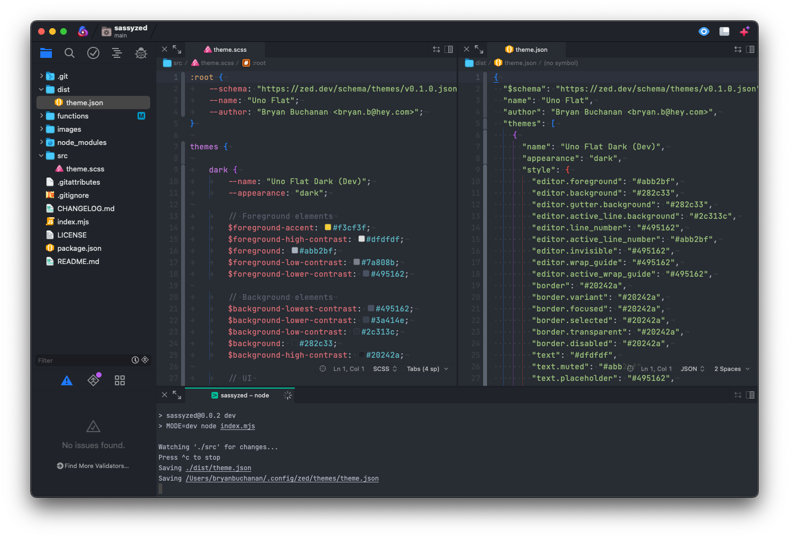

# SCSS Zed Theme Compiler

This package allows you to write Zed themes with SCSS.

It's a quick-and-dirty utility that compiles a SCSS file into a Zed JSON theme file, allowing you to develop in SCSS and take advantage of features like color variables.

## Setup

1. This utility requires `Node.js` to run, so you'll need to make sure that is installed on your local system.
1. Clone this repo and run `npm install` to install dependencies.

## Theme development

1. **Give your theme a name**: Inside the `src` folder is an example theme file to get started. Edit its name to make it easy to choose from the list of themes in Zed.
1. **Start the compiler**: Run `npm run dev` to compile and install the theme.
1. **Select your theme**: Navigate to the Zed themes menu and choose your theme.
1. **Develop**: Any changes to your `scss` file will automatically reflect in Zed, so you can see your changes in real-time.
1. Press `^c` in the terminal to stop the compiler.

## Theme publishing

1. Run `npm run build` to compile your theme.
1. Grab the JSON file from the `dist` folder to use in your theme extension.
1. Follow the instructions provided by Zed for publishing themes.

## Quirks

- CSS var prefixes (`--`) are stripped from the JSON output.
- Dashes (`-`) are replaced with periods (`.`) in the JSON output.
- Because this utility uses CSS vars to define values, SCSS variables need to be wrapped in `#{}` tags to be evaluated correctly.
